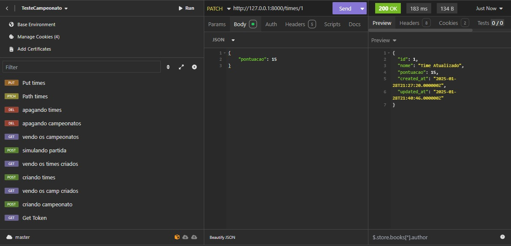

# Projeto: Aplicação Placar do Jogo

Este projeto é uma aplicação web desenvolvida com Laravel para gerenciar campeonatos, times, partidas e resultados. Ele permite a criação de campeonatos, a simulação de partidas e a visualização dos resultados finais.

## Funcionalidades Implementadas

- ✅ Instalação do Laragon
- ✅ Configuração do Laravel
- ✅ Banco de Dados SQLite configurado no `.env`
- ✅ Tabelas criadas e migrações executadas
- ✅ Criação do repositório no GitHub
- ✅ Endpoints para gerenciar campeonatos, times e resultados
- ✅ Simulação de partidas e geração de resultados no insominia.
- ✅ criação e efetuação de testes
## Estrutura do Projeto

O projeto é composto por três controladores principais:

1. **CampeonatoController**: Responsável por gerenciar campeonatos, incluindo criação, simulação, atualização e exclusão.
2. **ResultadoController**: Responsável por gerenciar os resultados dos campeonatos, incluindo atualização e exclusão.
3. **TimeController**: Responsável por gerenciar os times, incluindo criação, atualização e exclusão.

### Explicação de Trechos do Código

#### 1. **CampeonatoController**


- **Simulação de Campeonato (`simular`)**:
  ```
  php
  public function simular($id)
  {
      $campeonato = Campeonato::find($id);
  
      if (!$campeonato) {
          return response()->json(['error' => 'Campeonato não encontrado'], 404);
      }
  
      $times = Time::all();
      if ($times->count() != 8) {
          return response()->json(['error' => 'O campeonato deve ter exatamente 8 times'], 400);
      }
  
      $quartas = $this->chaveamentoQuartas($times);
      $semifinais = $this->chaveamentoSemifinais($quartas);
      $final = $this->chaveamentoFinal($semifinais);
  
      $resultados = $this->simularPartidas($quartas, $semifinais, $final, $campeonato);
  
      $resultado = Resultado::create([
          'campeonato_id' => $campeonato->id,
          'primeiro_lugar_id' => $resultados['vencedor']->id,
          'segundo_lugar_id' => $resultados['segundo']->id,
          'terceiro_lugar_id' => $resultados['terceiro']->id,
      ]);
  
      $campeonato->update([
          'resultado_id' => $resultado->id,
      ]);

      return response()->json([
          'message' => 'Campeonato simulado com sucesso!',
          'resultado' => $resultados,
          'campeonato' => $campeonato,
      ]);
  }
Este método simula um campeonato com base no ID fornecido. Ele verifica se o campeonato existe e se há exatamente 8 times cadastrados. Em seguida, realiza o chaveamento das quartas de final, semifinais e final, simulando as partidas e gerando os resultados.


**Simulação de Placar (`simularPlacar`)**: 
```
private function simularPlacar() { $caminhoScript = base_path('resources/python/teste.py'); $process = new Process(['py', $caminhoScript]); $process->run(); if (!$process->isSuccessful()) { Log::error('Erro ao executar script Python: ' . $process->getErrorOutput()); throw new ProcessFailedException($process); } $output = $process->getOutput(); $placar = explode("\n", trim($output)); Log::info('Placar simulado: ' . json_encode($placar)); return [ 'gols_time1' => (int)$placar[0], 'gols_time2' => (int)$placar[1], ]; } 
``` 
- Este método executa um script Python para simular o placar de uma partida. O script retorna os gols marcados por cada time, que são usados para determinar o vencedor da partida. 

2. ResultadoController
**Atualização de Resultado (`updateResultado`)**:

 ```
 public function updateResultado(Request $request, $id) { $campeonato = Campeonato::findOrFail($id); $resultado = $campeonato->resultado; if (!$resultado) { return response()->json(['error' => 'Resultado not found'], 404); } $validatedData = $request->validate([ 'primeiroLugar' => 'nullable|exists:times,id', 'segundoLugar' => 'nullable|exists:times,id', 'terceiroLugar' => 'nullable|exists:times,id', ]); $resultado->update($validatedData); return response()->json(['message' => 'Resultado updated successfully', 'resultado' => $resultado], 200); } 

```
- Este método permite a atualização dos resultados de um campeonato, incluindo o primeiro, segundo e terceiro lugares.

3. TimeController
**Criação de Time (`store`)**: 
```
php public function store(Request $request) { $request->validate(['nome' => 'required|string|max:255']); if (Time::count() >= 8) { return response()->json(['error' => 'O número máximo de times (8) já foi atingido.'], 400); } return Time::create($request->all()); } 
``` 
- Este método cria um novo time, mas apenas se o número máximo de times (8) ainda não foi atingido. 


## Simulação de teste  no Insomnia

## Requisição GET

A requisição `GET /campeonatos` retorna a lista de todos os campeonatos cadastrados.


## Requisição POST

A requisição `POST /campeonatos` cria um novo campeonato. O corpo da requisição deve conter o nome do campeonato.


## Requisição de Simulação

A requisição `POST /campeonatos/{id}/simular` simula um campeonato com base no ID fornecido. O resultado da simulação é retornado na resposta.



## alguns prints a mais dos testes

### path times


### put times


### teste executados


## documentação (collection) do Insomnia
[documentação (collection) do Insomnia](./Insomnia_2025-01-28.json)

## Dockers

foi tentado implementar a subida do dockers que foi criado a imagem e executado mas ele tem algusn problemas de execuçoes que faz ele não achar o **.sqlite** e quando executando o **php artisan serve** ele cria o local mas não e acessivel